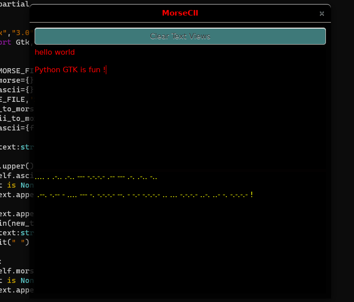

# MorseCII

Morse to Ascii

This is just a toy app using Python Gtk.

The purpose was to just learn how to use Python3 and Gtk3. All this app does is you type text in the top text view and it writes it in morse code the bottom text view and vice versa.

Ctrl+E to switch text view focus

